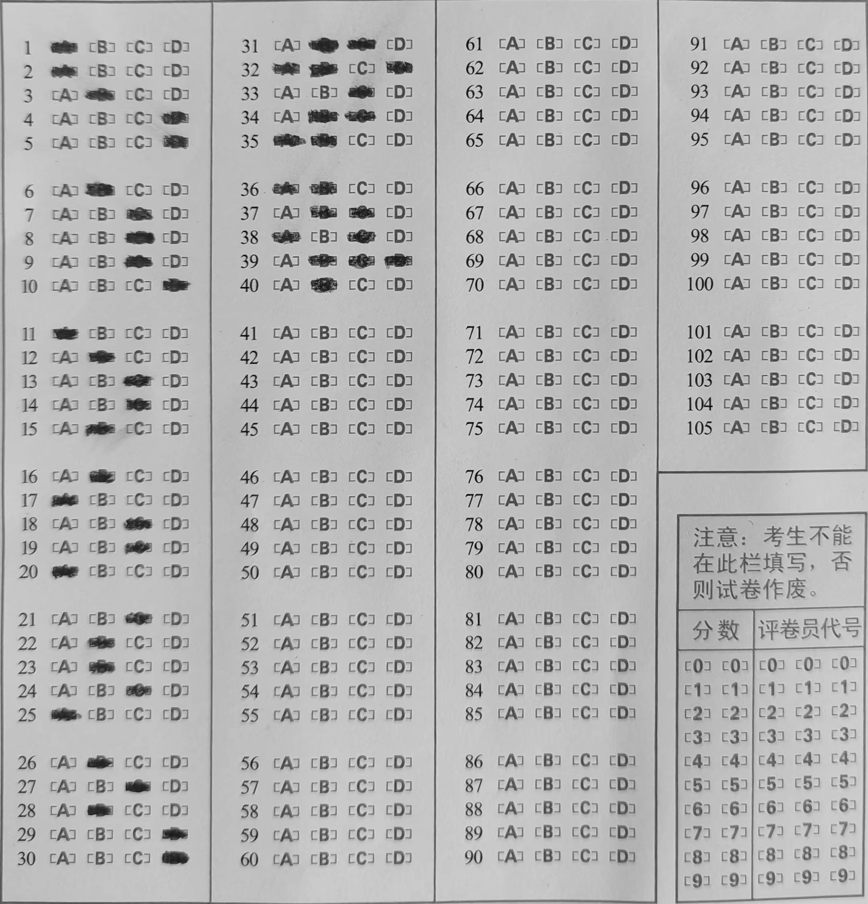

# Answer-sheet-recognition
基于opencv和python的答题卡识别，但只能识别项目中给出的图像dtk1和dtk2，且参数不一致
# 主要参考
https://github.com/inuyasha2012/answer-sheet-scan
# 实现流程如下，具体实现请看代码
首先将图像灰度化并高斯模糊

接着边缘检测

由于我们需要找出选项框区域，所以找出有6个点的轮廓，然后我们经过一系列计算，得出透视变换的矩阵，并矫正

接着通过膨胀腐蚀获取涂黑选项

再取出涂黑的轮廓，根据每个轮廓的坐标统计就行拉

最终结果

# 注意
项目给出的两张答题卡需要根据注释来调整参数才能获得很好的效果，所以项目并不是一个通用的代码，原因是我没有找到一个平衡的参数

# 安装
安装opencv2
